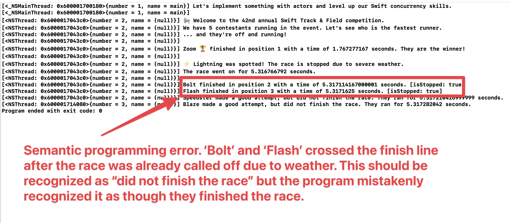

# swift-playground

📚 Learning and exploring the Swift programming language.

> Swift. The powerful programming language that is also easy to learn.
>
> -- <cite>https://developer.apple.com/swift</cite>


## Description

**NOTE**: This project was developed on macOS. It is for my own personal use.

This project is for me to explore the Swift programming language, which is quite rich and at times difficult for me to
wrangle. By contrast, my codebase <https://github.com/dgroomes/macos-playground> is designed to explore macOS platform
APIs and macOS operating system concerns like process management. 

This project is implemented as a multi-module Swift project. I use the term "multi-module" in the general programming
sense. Programming languages and their toolchains use specific language to describe modular program design. Swift programs
built with the Swift Package Manager have an impressive amount of options when it comes to modularity. Just read the later
section [Making Sense of the Swift Package Manager](#making-sense-of-the-swift-package-manager).


## Xcode Notes

This project is a good fit for me to learn Xcode and take some notes. While Swift doesn't necessarily need to be
developed in Xcode, nor does it even need to be developed on a Mac or even target an Apple system, I'm doing the
mainstream thing and using Xcode. But I'm a newbie at Xcode. I'd like at least to understand the basics of the "power
tools" when it comes to using Xcode. I want the familiar leverage of Intellij features like "Search everywhere",
back/forward controls, "go to implementation", "refactor/rename". The big ones.

Here are some miscellaneous notes/observations:

* Xcode's markdown smarts doesn't parse/recognize code fences on the first line of a bullet point or numbered bullet.
  It makes all the text below it gray. It looks like a workaround is to keep the contents of the first line empty and
  and put the code fence on the next line. This seems like it's still legal markdown syntax because I see the numbers
  render when I use a markdown renderer (and strangely, can't get Xcode to show a markdown render/preview? it's stuck in
  a source code mode)
* I can't use refactorings, they were greyed out. I had to resort to the tacky "delete internal files" trick and
  thank you very much to [this StackOverflow Q&A](https://stackoverflow.com/a/47425586). To be fair, I have to do stuff
  like that in Intellij too, so it's normal, although it's a head scratcher. UPDATE: it's grayed out again.. so
  frustrating. I use 'extract variable' to make sense of the return types and break the code down so I can learn it. 


## Instructions

Follow these instructions to build and run a demo Swift program:

1. Pre-requisite: Swift
   * I'm using Swift 5.8
2. Build and run the "file and logging" program:
   * 
     ```shell
     swift run SwiftPlaygroundFileLogging
     ```
   * It should look something like this:
     ```text
     $ swift run
     Building for debugging...
     [4/4] Linking SwiftPlaygroundFileLogging
     Build complete! (0.76s)
     Welcome to my 'swift-playground'! Let's write some Swift code that writes to a file.
     The 'log' function is convenient. Calling code can use 'log' and the message gets printed to the screen and written to the log file.
     ```
   * The `run` command is convenient because it builds and runs the program. In the next step, let's try only building
     the program, and not running it.
   * Let's check the contents of the log file using the following command.
     ```shell
     cat ~/Library/Logs/swift-playground.log
     ```
   * The output will look something like this:
     ```text
     13:21:50: Welcome to my 'swift-playground'! Let's write some Swift code that writes to a file.
     13:21:50: The 'log' function is convenient. Calling code can use 'log' and the message gets printed to the screen and written to the log file.
     ```
3. Build a binary
   * Link the program into a binary executable file with the following command.
   * 
     ```shell
     swift build
     ```
   * Run the program from the binary with the following command.
   * 
     ```shell
     .build/arm64-apple-macosx/debug/SwiftPlaygroundFileLogging
     ```
   * Tip: if you want to clean up old build files just to "make sure things are working" then use the following clean command.
   * 
     ```shell
     swift package clean
     ```
4. Build and run the "async/await" program:
   * 
     ```shell
     swift run SwiftPlaygroundAsyncAwait
     ```
   * It should look something like this:
     ```text
     $ swift run SwiftPlaygroundAsyncAwait
     Building for debugging...
     Build complete! (0.13s)
     
     Let's explore concurrency by way of executing multiple simulated 'data fetch' operations.
     Fetching 'inbox' data from an external source...
     Fetching 'photos' data from an external source...
     Fetching 'news' data from an external source...
     Data fetch of 'inbox' complete!
     Data fetch of 'photos' complete!
     Data fetch of 'news' complete!
     Found Fake data for 'inbox'
     Found Fake data for 'photos'
     Found Fake data for 'news'
     All data fetches completed in 3.005929541 seconds.
     ```
5. Build and run the "actors" program:
   * 
     ```shell
     swift run SwiftPlaygroundActors
     ```
   * The output will look something like this:
     ```text
     [<_NSMainThread: 0x6000017040c0>{number = 1, name = main}] Let's implement something with actors and level up our Swift concurrency skills.
     [<_NSMainThread: 0x6000017040c0>{number = 1, name = main}] 
     [<NSThread: 0x600001704340>{number = 2, name = (null)}] 📢 Welcome to the 42nd annual Swift Track & Field competition.
     [<NSThread: 0x600001704340>{number = 2, name = (null)}] We have 5 contestants running in the event. Let's see who is the fastest runner.
     [<NSThread: 0x600001704340>{number = 2, name = (null)}] ... and they're off and running!
     [<NSThread: 0x600001704340>{number = 2, name = (null)}] 
     [<NSThread: 0x60000170c040>{number = 3, name = (null)}] Zoom 🏆 finished in position 1 with a time of 1.345394458 seconds. They are the winner!
     [<NSThread: 0x60000170c040>{number = 3, name = (null)}] Speedster finished in position 2 with a time of 1.611739541 seconds. [isStopped: false]
     [<NSThread: 0x60000170c040>{number = 3, name = (null)}] Blaze finished in position 3 with a time of 3.345048375 seconds. [isStopped: false]
     [<NSThread: 0x60000170c080>{number = 4, name = (null)}] 
     [<NSThread: 0x60000170c080>{number = 4, name = (null)}] ⚡️ Lightning was spotted! The race is stopped due to severe weather.
     [<NSThread: 0x60000170c080>{number = 4, name = (null)}] The race went on for 5.328475375000001 seconds.
     [<NSThread: 0x60000170c080>{number = 4, name = (null)}] 
     [<NSThread: 0x60000170c080>{number = 4, name = (null)}] Flash made a good attempt, but did not finish the race. They ran for 5.32886775 seconds.
     [<NSThread: 0x60000170c080>{number = 4, name = (null)}] Bolt made a good attempt, but did not finish the race. They ran for 5.328921791000001 seconds.
     ```
   * Concurrent programming is tricky. Here is what happened when I didn't have the check for `isStopped`.
   * 


## Making Sense of the Swift Package Manager

The [Swift Package Manager](https://www.swift.org/package-manager/) is really cool. I really like the `Package.swift`
file. It is similar to Gradle in the way that it's a project manifest descriptor but not written in a configuration
language but written in a full weight programming language: Swift for `Package.swift` and Groovy for `build.gradle` or
Kotlin for `build.gradle.kts`. Similarly to Gradle, it's on the higher side of complexity (please note: no build system
matches the gigantic feature set of Gradle). I'm trying to understand the following concepts which are listed in the
docs and how they relate to one another:

* *Modules*
* *Namespaces*
* *Programs*
* *Dependencies*
* *Packages*
* *Targets*
* *Products*
* *Libraries*
* *Executables*

Here are some notable quotes from those docs:

> Swift organizes code into *modules*.

> Each module specifies a namespace and enforces access controls on which parts of that code can be used outside of the
> module.

> A program may have all of its code in a single module, or it may import other modules as *dependencies*.

> A *package* consists of Swift source files and a manifest file.

> A package has one or more targets. Each target specifies a product and may declare one or more dependencies.

> A target may build either a library or an executable as its product.

> A *library* contains a module that can be imported by other Swift code.

> An *executable* is a program that can be run by the operating system.

> A target’s dependencies are modules that are required by code in the package.

> By convention, a target includes any source files located in the `Sources/<target-name>` directory.


## Swift Language Notes

Swift is far more feature-rich than I expected. I had heard it compared to Kotlin, but I've found the type system to be
in the stratosphere of complexity like TypeScript and Rust. Kotlin is not like this. On the other hand, I might be
underestimating Kotlin's complexity especially when it comes to Coroutines, because I've found Swift concurrency language
features to also be sophisticated (not a bad thing; just a learning curve). I have an especially hard time with
`async let`, because I don't know how to think of this in terms of a type. It makes me appreciate how you can just `await`
a `Promise` in JavaScript.


## Wish List

General clean ups, TODOs and things I wish to implement for this project:

* [x] DONE (it turns out a Swift project has things like a `Package.swift` file) Structure the project in the way that the Swift *Package Manager* would. Swift has an impressive life outside of
  Apple. Just visit the [Swift website](https://www.swift.org/) to see extensive guides, reference, and community things
  and notice that this information is presented outside the context of Apple. (Of course Apple is still there but not in an overt way)
  This is pretty cool. Can I eject this project from Xcode (well, I'm using AppCode)?. Answer: no, this is not possible.
  [AppCode is not considered a lightweight IDE](https://intellij-support.jetbrains.com/hc/en-us/community/posts/360005062659-Can-I-get-Swift-code-completion-and-syntax-highlighting-in-IntelliJ-).
* [x] DONE Implement something just a bit more interesting than "hello world"
* [x] DONE How do you implement multi-module Swift projects? What does the directory layout look like? Where do I start?
* [x] DONE Implement something that starts another process
* [ ] Heed the warning described by the [`FileManager.fileExists` docs](https://developer.apple.com/documentation/foundation/filemanager/1415645-fileexists)
   * > Attempting to predicate behavior based on the current state of the file system or a particular file on the file
       system is not recommended. Doing so can cause odd behavior or race conditions. It’s far better to attempt an
       operation (such as loading a file or creating a directory), check for errors, and handle those errors gracefully
       than it is to try to figure out ahead of time whether the operation will succeed.
   * This is not something I've taken seriously in my Java code, but I'm happy to write my Swift more robustly in
     this regard.
* [x] DONE Compile/link/whatever a Swift program into a binary executable file
* [x] DONE Write to a file. I want to know the boilerplate to write a new file and append to an existing one.
* [x] DONE Concurrency examples. Specifically, I'll start with `async/await`.
* [x] DONE Clean up the logging stuff. Rebrand it as something like `FileLogger`
  * I'm going to make a logger class.
* [x] DONE Consolidate the example code in `main.swift`.
* [x] DONE (Partially; I'm not satisfied in my experience with continuations and futures, and the features of async in Swift like `async let`, but this will do for now.) Do more concurrency examples. I want to take APIs that I wish supported `async/await`, and adapt them for use with
  `async/await`. The `Process` API is a good candidate for this. However, I may be better off with simulated examples
  using `sleep` or something, to reduce the scope of the project.
* [x] DONE Move the process stuff to <https://github.com/dgroomes/macos-playground>. The `Process` API is really a concept
  of the operating system APIs and not the Swift language. I want to keep this project focused on the Swift language.
* [x] DONE Re-organize with multiple `main` entrypoints. I like that style better, especially if there are 3+ things to
  showcase, it's awkward putting them in the same main.
* [x] DONE Do something with actors. I want something like the racing demo I previously implemented. I think I can just use
  `Task` and it will be interesting enough. One goal is to actually learn some terms (correctly) and relate them to the
  code example. 
* [x] DONE Showcase task cancellation. The value proposition of `Task` is that they let you move on to other
  code paths and then later *revisit* the `Task` to await its completion or to cancel it. I don't really grok how
  cancellation looks in the code yet. Let's try it in the actors/racing demo.
* [x] DONE Push more of the race management into the RaceManager actor. I think I need to synchronize the 'print'
  statements because the program techically can race if the 'raceTask.cancel' literally triggers the other tasks to
  unsuspend on a different/available core (I'm 80% sure).
* [x] DONE (Yeah straight Tasks with a wrapper Task is great) I'm still confused about the purpose of tasks groups. Can you get the same effect as a task group by just using
  an outer Task?


## Reference

* [Swift website](https://www.swift.org/)
* [The Swift Package Manager](https://www.swift.org/package-manager/)
  * This page is required reading. You'll have to read it a few times to grok packages, targets, products, libraries,
    executables, etc.
* [Apple Developer Docs: *Target*](https://developer.apple.com/documentation/packagedescription/target)
  * > You can vend targets to other packages by defining products that include the targets.
    > 
    > A target may depend on other targets within the same package and on products vended by the package’s dependencies. 
* [Apple Developer Docs: *FileManager*](https://developer.apple.com/documentation/foundation/filemanager)
  * > A convenient interface to the contents of the file system, and the primary means of interacting with it.
* [Apple Developer Docs: *Process*](https://developer.apple.com/documentation/foundation/process)
* [*The Swift Programming Language: Concurrency*](https://docs.swift.org/swift-book/documentation/the-swift-programming-language/concurrency)
  * > The concurrency model in Swift is built on top of threads, but you don’t interact with them directly.
* [Apple Developer Docs / Swift Standard Library: *CheckedContinuation*](https://developer.apple.com/documentation/swift/checkedcontinuation)
  * > A mechanism to interface between synchronous and asynchronous code, logging correctness violations.
* [Apple WWDC video: *Protect mutable state with Swift actors*](https://developer.apple.com/videos/play/wwdc2021/10133)
  * Note: I had to look for this video because the word "actors" is not in the [language book](https://docs.swift.org/swift-book/documentation/the-swift-programming-language/basicoperators). That's a language feature. The video is quite nice, there's even a transcript!
  * UPDATE: I did find it in the Swift book, it's in "Concurrency", it's just that "actors" can't be found from the
    search feature or from a "Cmd + F" on the main page. 
